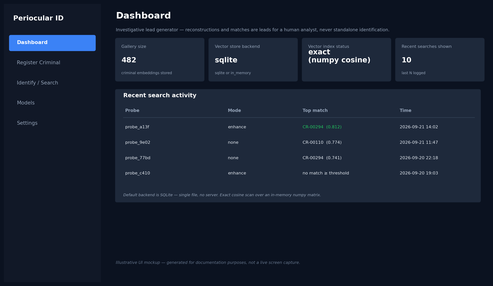
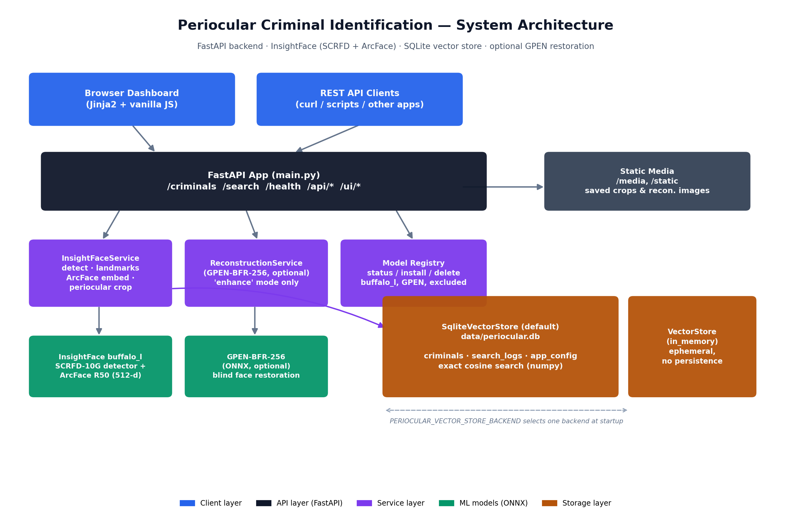
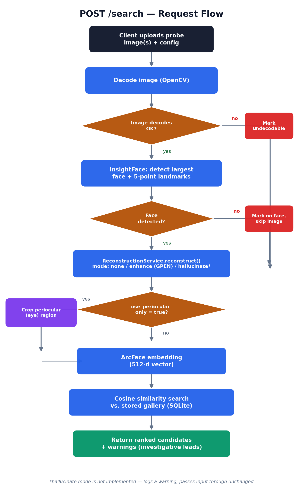

<div align="center">

# 👁️ Periocular Criminal Identification

**A FastAPI backend + dashboard for periocular (eye-region) and masked-face biometric identification, built for investigative lead generation.**

[](LICENSE)
[](https://www.python.org/downloads/)
[](https://fastapi.tiangolo.com/)
[](CONTRIBUTING.md)
[](#-contributing)

[Overview](#-overview) •
[Architecture](#-architecture) •
[How It Works](#-how-it-works) •
[Tech Stack](#-tech-stack--aiml-models) •
[Getting Started](#-getting-started) •
[API Reference](#-api-reference) •
[Limitations](#️-honest-limitations--responsible-use) •
[Contributing](#-contributing)

</div>

---

## 📌 Overview

**Periocular Criminal Identification** is an open-source research/investigative-tooling project that identifies people from **partial, occluded, or masked face images** by focusing on the **periocular region** (the eyes and immediate surrounding area) — the part of the face that typically stays visible even when someone is wearing a mask, scarf, or helmet.

It ships as:

- A **FastAPI REST API** for registering known faces and searching probe images against that gallery.
- A **built-in web dashboard** (register, search, model management, settings) so it's usable without writing any client code.
- A **pluggable vector store** (SQLite by default, in-memory for quick testing).

### Why periocular?

Traditional face recognition needs a full, unobstructed face. In real-world scenes — CCTV footage, crowd cameras, someone wearing a mask or balaclava — that's often not available. The periocular region survives most occlusions, so this project detects it, extracts a biometric embedding from it, and ranks it against a gallery of known identities.

> **This is an investigative lead generator, not a courtroom-grade identification system.** Every match it returns is a similarity-ranked candidate for a trained human analyst to review — never an automated, standalone accusation. See [Honest Limitations & Responsible Use](#️-honest-limitations--responsible-use) before using this on real data.

---

## 🖼️ Preview

<p align="center">
  
</p>

<p align="center"><sub>Illustrative UI mockup generated for documentation — run the app locally to see the live dashboard.</sub></p>

---

## 🏗️ Architecture

<p align="center">
  
</p>

The system is split into four layers:

| Layer | Component | Responsibility |
|---|---|---|
| **Client** | Dashboard (Jinja2 + JS) / REST clients | Upload images, view results |
| **API** | `main.py` (FastAPI) | Routing, validation, orchestration |
| **Services** | `InsightFaceService`, `ReconstructionService`, `model_registry` | Detection, embedding, restoration, model lifecycle |
| **Storage** | `SqliteVectorStore` / `VectorStore` | Persist embeddings, metadata, search logs, config |

## 🔄 How It Works

<p align="center">
  
</p>

1. **Register** known individuals via `POST /criminals` with one or more full-face images — each is embedded and stored in the gallery.
2. **Search** a probe image via `POST /search`:
   - The largest face is detected with **SCRFD** (via InsightFace).
   - Optionally restored/sharpened with **GPEN** (`reconstruction_mode="enhance"`).
   - Optionally cropped down to just the **periocular region** (`use_periocular_only=true`) for masked/occluded probes.
   - Embedded with **ArcFace** into a 512-dimensional vector.
   - Compared against every stored embedding with **cosine similarity**.
3. The **top-K ranked candidates** are returned with similarity scores — for a human analyst to review.

---

## 🧠 Tech Stack & AI/ML Models

### Backend
- **[FastAPI](https://fastapi.tiangolo.com/)** — async REST API framework
- **[Uvicorn](https://www.uvicorn.org/)** — ASGI server
- **[Pydantic / pydantic-settings](https://docs.pydantic.dev/)** — request validation & environment-based config
- **[Jinja2](https://jinja.palletsprojects.com/)** — server-rendered dashboard templates
- **SQLite** (via Python's built-in `sqlite3`) — zero-setup persistence, WAL mode for concurrent reads

### AI / ML Models
| Model | Role | Library |
|---|---|---|
| **SCRFD-10G** (part of InsightFace `buffalo_l`) | Face detection + 5-point landmarks | [`insightface`](https://github.com/deepinsight/insightface) |
| **ArcFace (ResNet-50)** (part of `buffalo_l`) | 512-d face/periocular embedding | [`insightface`](https://github.com/deepinsight/insightface) |
| **GPEN-BFR-256** *(optional)* | Blind face restoration / sharpening of low-quality crops | ONNX Runtime |
| ~~DW-KSVD + GAN periocular→full-face hallucination~~ | Not implemented — see [below](#️-honest-limitations--responsible-use) | — |
| ~~inswapper_128~~ | Deliberately excluded (face-swap, not reconstruction) | — |

### Image Processing / Numerics
- **[OpenCV](https://opencv.org/)** (`opencv-python-headless`) — image decode/resize/crop
- **[NumPy](https://numpy.org/)** — vectorized cosine-similarity search
- **[ONNX Runtime](https://onnxruntime.ai/)** (CPU / CUDA) — model inference

### Frontend
- Vanilla HTML/CSS/JS dashboard, server-rendered via Jinja2 — no build step required

---

## 📂 Project Structure

```
periocular-criminal-identification/
├── services/
│   ├── insightface_service.py     # Detection, landmarks, embedding, periocular crop
│   ├── reconstruction_service.py  # Optional GPEN-based restoration
│   ├── model_registry.py          # Model status / install / delete
│   ├── sqlite_store.py            # SQLite-backed vector store (default)
│   └── vector_store.py            # In-memory vector store (testing)
├── templates/                     # Dashboard pages (Jinja2)
│   ├── base.html
│   ├── dashboard.html
│   ├── register.html
│   ├── search.html
│   ├── models.html
│   └── settings.html
├── docs/
│   ├── images/                    # README diagrams / mockups
│   └── ORIGINAL_DEV_NOTES.md      # Original implementation notes
├── config.py                      # Environment-driven settings
├── main.py                        # FastAPI app & routes
├── schemas.py                     # Pydantic request/response models
├── requirements.txt
├── .env.example
├── LICENSE
├── CONTRIBUTING.md
├── CODE_OF_CONDUCT.md
└── README.md
```

---

## 🚀 Getting Started

### Prerequisites
- Python **3.10+**
- (Optional) an NVIDIA GPU + CUDA for faster inference — CPU works fine for moderate loads

### Installation

```bash
git clone https://github.com/Amaan9136/periocular-criminal-identification.git
cd periocular-criminal-identification

python -m venv venv
source venv/bin/activate      # Windows: venv\Scripts\activate

pip install -r requirements.txt
cp .env.example .env          # optional: override defaults
```

### Run

```bash
uvicorn main:app --reload
```

Then open **http://localhost:8000/** for the dashboard.

> The `buffalo_l` model pack is downloaded automatically on first run (cached to `~/.insightface/models/buffalo_l/`). To enable optional face restoration, either set `PERIOCULAR_GPEN_MODEL_PATH` before starting, or install it from the **Models** tab once the app is running.

### Installing models from the Models tab

The **Models** tab (`/ui/models`) lets you install `buffalo_l` and `GPEN-BFR-256` three ways:

| Method | What it does |
|---|---|
| **Download** | Fetches the model from a known URL and saves it under `models/` (or `~/.insightface/models/buffalo_l/` for `buffalo_l`). Equivalent to `curl -L "<url>" -o models/GPEN-BFR-256.onnx`. |
| **Local path** | Copies/unzips a file already on this machine — no network needed. Point it at a `.zip` or a folder of `.onnx` files for `buffalo_l`, or a `.onnx` file for GPEN. |
| **Upload** *(GPEN only)* | Uploads a `.onnx` file through the browser. |

### Configuration

All settings are environment variables prefixed `PERIOCULAR_` (see `.env.example`):

| Variable | Default | Description |
|---|---|---|
| `VECTOR_STORE_BACKEND` | `sqlite` | `sqlite` (persistent) or `in_memory` (ephemeral) |
| `SQLITE_PATH` | `data/periocular.db` | Path to the SQLite database file |
| `PREFER_GPU` | `true` | Use CUDA if available |
| `TOP_K` | `10` | Default number of candidates returned |
| `MIN_DET_SCORE` | `0.5` | Minimum face-detector confidence |
| `RECONSTRUCTION_MODE_DEFAULT` | `none` | `none` \| `enhance` \| `hallucinate` |
| `GPEN_MODEL_PATH` | *(unset)* | Path to `GPEN-BFR-256.onnx` |
| `GPEN_DOWNLOAD_URL` | *(unset)* | URL used by the Models tab's "Download" option for GPEN-BFR-256 |

---

## 📡 API Reference

| Method | Endpoint | Description |
|---|---|---|
| `POST` | `/criminals` | Register a known individual (`criminal_id`, `name`, `metadata`, `images[]`) |
| `POST` | `/search` | Search probe image(s) against the gallery |
| `GET` | `/health` | Liveness check + gallery size |
| `GET` | `/api/stats` | Dashboard stats (gallery size, backend, recent searches) |
| `GET` | `/api/models` | List model status (required/optional/installable) |
| `POST` | `/api/models/{id}/install` | Install a model (e.g. `buffalo_l`, `gpen_bfr_256`) |
| `DELETE` | `/api/models/{id}` | Remove a model |
| `GET` / `POST` | `/api/config` | Read/update runtime settings |

**Example — search:**

```bash
curl -X POST http://localhost:8000/search \
  -F "probe_id=probe_001" \
  -F 'config_json={"top_k":5,"reconstruction_mode":"enhance","use_periocular_only":true}' \
  -F "images=@probe.jpg"
```

Full interactive docs are auto-generated by FastAPI at **`/docs`** (Swagger UI) once the app is running.

---

## ⚠️ Honest Limitations & Responsible Use

This project documents its limitations deliberately, rather than hiding them:

- **No authentication or rate limiting** on the API or dashboard by default — add both before pointing this at any real, sensitive, or production data.
- **`use_periocular_only` sacrifices accuracy.** ArcFace was trained on full faces, not eye-region crops, so expect a real drop in accuracy versus full-face probes.
- **`reconstruction_mode="hallucinate"` (periocular → full-face generation) is intentionally not implemented.** No maintained open-source model exists for this without fabricating facial detail that was never actually observed — doing so convincingly would be actively dangerous in an identification context. Calling it logs a warning and passes the image through unchanged.
- **`inswapper_128` is deliberately excluded**, even though it's a common local model. It's a face-*swap* model, not a restoration model — it would paste a different person's face onto the image with no way to tell it was fabricated. That's not a reconstruction, it's a false identity.
- **Every result is a candidate, not a verdict.** Biometric similarity search — periocular search especially — carries a real risk of false matches, and that risk is not evenly distributed across demographics in publicly available face-recognition research. This tool is built for generating leads for a trained human analyst to independently verify, with full awareness of chain-of-custody, consent, and legal requirements in their jurisdiction — not for automated or unsupervised identification, and not for surveillance of individuals without lawful authority.

If you fork or deploy this, please keep these caveats intact and add your own organization's safeguards (auth, audit logging, human review workflows, bias testing) before using it on real people.

---

## 🗺️ Roadmap

- [ ] Authentication & role-based access control
- [ ] Rate limiting
- [ ] Approximate nearest-neighbor index (FAISS/HNSW) for large galleries
- [ ] Dockerfile + docker-compose
- [ ] Automated test suite
- [ ] Bias/fairness evaluation harness across demographic subgroups

Have an idea? Open an [issue](https://github.com/Amaan9136/periocular-criminal-identification/issues) or see [Contributing](#-contributing).

---

## 🤝 Contributing

Contributions are welcome — this project is open source so others working on biometric research, forensics tooling, or FastAPI/ML systems can build on it. Please read [CONTRIBUTING.md](CONTRIBUTING.md) and [CODE_OF_CONDUCT.md](CODE_OF_CONDUCT.md) first.

Quick start for contributors:

```bash
git checkout -b feat/your-feature-name
# make your changes
git commit -m "feat: short description of the change"
git push origin feat/your-feature-name
# open a Pull Request
```

See [`.github/COMMIT_CONVENTION.md`](.github/COMMIT_CONVENTION.md) for the commit message format used in this repo.

---

## 📄 License

This project is licensed under the **MIT License** — see [LICENSE](LICENSE) for details. You're free to use, modify, and distribute it, including commercially, provided the license and copyright notice are retained.

---

## 👤 Author

**Amaan Mohammed Khalander**
GitHub: [@Amaan9136](https://github.com/Amaan9136)

If this project is useful to you, consider ⭐ starring the repo and sharing feedback via [issues](https://github.com/Amaan9136/periocular-criminal-identification/issues).

<div align="center">
<sub>Built for investigative research and forensic tooling exploration. Use responsibly.</sub>
</div>
